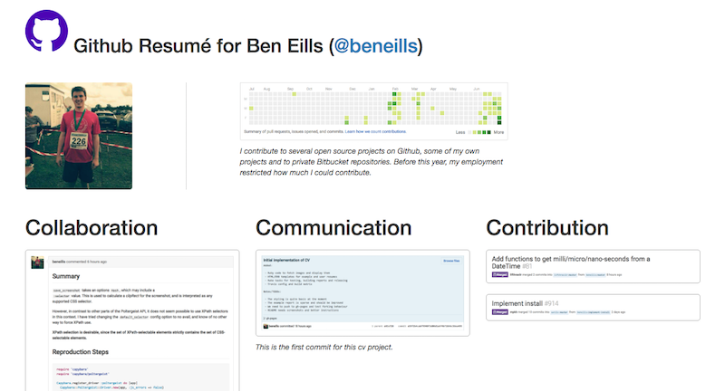

# CV
_Generate a resumé of your Github activity!  See a live example [here](http://beneills.github.io/cv)._




## Usage

```shell
# fork repository
git clone https://github.com/USERNAME/cv
cd cv
edit templates/index.html # or use the default
rake
open index.html
```

## Publishing

__TODO__ test this process

```shell
# on branch gh-pages
git commit -am 'Customize my resumé' && git push
open http://USERNAME.github.io/cv
```

## Contributing

 - Create or take ownership of an issue
 - Fork _gh-pages_ branch
 - Write code
 - `rake test`
 - `rake release`
 - Commit [with a reasonable message](http://chris.beams.io/posts/git-commit/)
 - Push and possibly run [Travis](travis-ci.org/) on your fork
 - Submit a pull request
