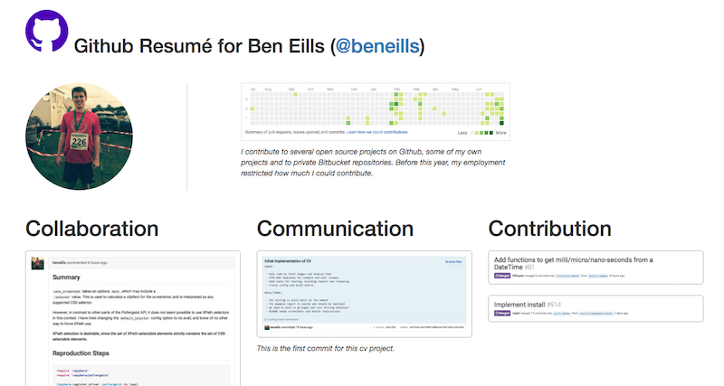

[](https://travis-ci.org/beneills/cv)

# CV
_Generate a resumé of your Github activity!  See a live example [here](http://beneills.github.io/cv)._

## Why

In __five minutes__ you can show off your best public activity on Github, whether commits, pull requests, stats or conversations, and publish this online.  This means you can direct people towards the work you want to emphasize.  __With more time__, you can customize your resumé by changing basic HTML, adding whatever else you want to it.




## Usage

```shell
# fork repository
git clone https://github.com/USERNAME/cv
cd cv
# apt-get install phantomjs or brew install phantomjs
bundle install
edit templates/index.html # or use the default
rake
open index.html
```

## Publishing

```shell
# on branch gh-pages
git commit -am 'Customize my resumé' && git push
open http://USERNAME.github.io/cv
```

## Contributing

 - Create or take ownership of an issue
 - Fork _gh-pages_ branch
 - Write code
 - `rake test`
 - `rake release`
 - Commit [with a reasonable message](http://chris.beams.io/posts/git-commit/)
 - Push and possibly run [Travis](travis-ci.org/) on your fork
 - Submit a pull request
